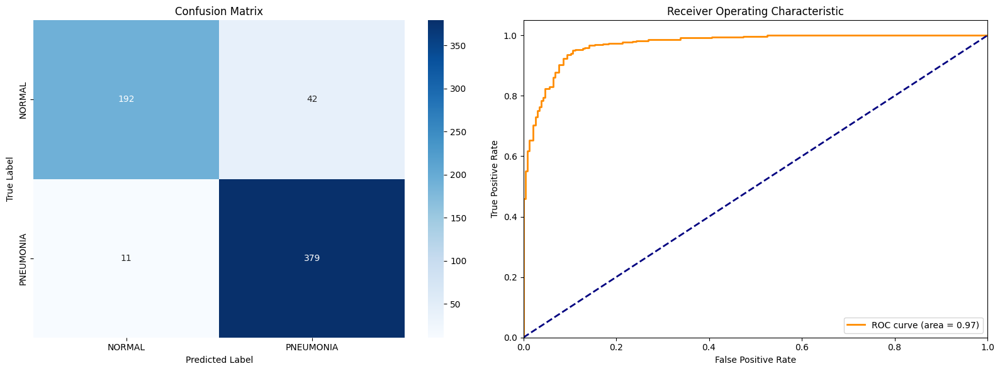
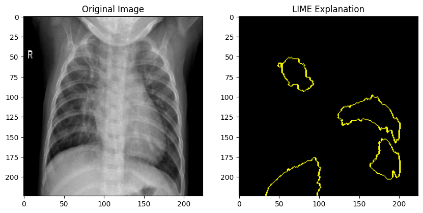

# Pneumonia-Detection-CXR
Attention Ensemble | LIME

## Introduction: 

Pneumonia is a disease caused by both viruses and bacteria. It is one of the major lung diseases that cause death to many people every year around the globe. So early detection can be crucial
to avoid critical situations and deaths. Following [1](#References) this research and tuning learning rate for a given set of other hps, the best model achieved a 92% f-1 score and 97% AUC on the test set.

## 1. Methodology

1.1 **Data Preprocessing & Augmentation**

The dataset used for this project consists of chest X-ray images classified into two categories: pneumonia and normal. The training dataset was augmented using the following transformations:

   - Rescaling: Pixel values were rescaled by 1/255.0 to normalize the input.
   - Rotation: Images were randomly rotated within a range of 15 degrees.
   - Width and Height Shift: Images were randomly shifted horizontally and vertically by up to 10%.
   - Shear & Zoom Transformations: Images were sheared by 0.2 and zoomed within the range of 0.2.
   - Brightness Adjustments: Brightness varied between 80% and 120% of the original.
   - Validation Split: 15% of the training data was reserved for validation.

1.2 **Model architecture**

The model architecture integrates two pre-trained base models, EfficientNetB0 and DenseNet121, which extract rich feature representations from input images. These models are set as non-trainable during initial training. A Multi-Head Self-Attention mechanism is applied to enhance feature extraction to capture global dependencies, followed by Channel Attention to focus on the most important channels in the feature maps. A residual block is then added to prevent feature degradation and facilitate smooth gradient flow. After these attention mechanisms and residual connections, the model uses Global Average Pooling to reduce the feature maps to a 1D vector. Finally, a dense layer with a sigmoid activation function is applied for binary classification, predicting whether the input image shows pneumonia or not.

                                                            Input (224, 224, 3)
                                                                  |
                                                                  V
                                                +-------------------------+
                                                |                         |                       
                                                |                         |                       
                                       +-----------------------+  +-----------------------+  
                                       |   EfficientNetB0      |  |    DenseNet121        |
                                       |    (Feature Extractor) |  |    (Feature Extractor) |
                                       +-----------------------+  +-----------------------+
                                                |                         |
                                                |                         |
                                                |                         |
                                                +-------------------------+
                                                              |
                                                              V
                                                    +-----------------------+
                                                    |    Concatenate        |
                                                    |   (Combine Features)  |
                                                    +-----------------------+
                                                              |
                                                              V
                                                    +-----------------------+
                                                    | Multi-Head Self-      |
                                                    |   Attention Module     |
                                                    +-----------------------+
                                                              |
                                                              V
                                                    +-----------------------+
                                                    |  Channel Attention     |
                                                    |    (Feature Fusion)    |
                                                    +-----------------------+
                                                              |
                                                              V
                                                    +-----------------------+
                                                    |    Residual Block      |
                                                    +-----------------------+
                                                              |
                                                              V
                                                    +-----------------------+
                                                    |   Global Average Pooling|
                                                    +-----------------------+
                                                              |
                                                              V
                                                    +-----------------------+
                                                    |        Dropout        |
                                                    +-----------------------+
                                                              |
                                                              V
                                                    +-----------------------+
                                                    |     Dense Layer       |
                                                    |    (1 neuron, Sigmoid) |
                                                    +-----------------------+
                                                              |
                                                              V
                                                     Output (Probability of Pneumonia)

## 2. Training Strategy
   - Libraries: Keras, Tensorflow
   - Optimizer: Adam
   - Loss Function: Binary Crossentropy
   - Callbacks: Early Stopping, ReduceLROnPlateau, Modelcheckpoint
   - Class Imbalance: Class weights
   - Evaluation Metrics: Precision, Recall, f-1 score, auc-roc
   

## 3. Explainability
To provide insights into how the model makes predictions, the LIME (Local Interpretable Model-agnostic Explanations) technique was employed. The LIME explanations highlighted key regions in the X-ray images that were most influential in the model’s decision-making process. Here is a single image with CXR and the areas that are responsible for pneumonia determined by LIME.

## References
1. An, Q.; Chen, W.; Shao, W. A Deep Convolutional Neural Network for Pneumonia Detection in X-ray Images with Attention Ensemble. Diagnostics 2024, 14, 390. https:// doi.org/10.3390/diagnostics14040390
